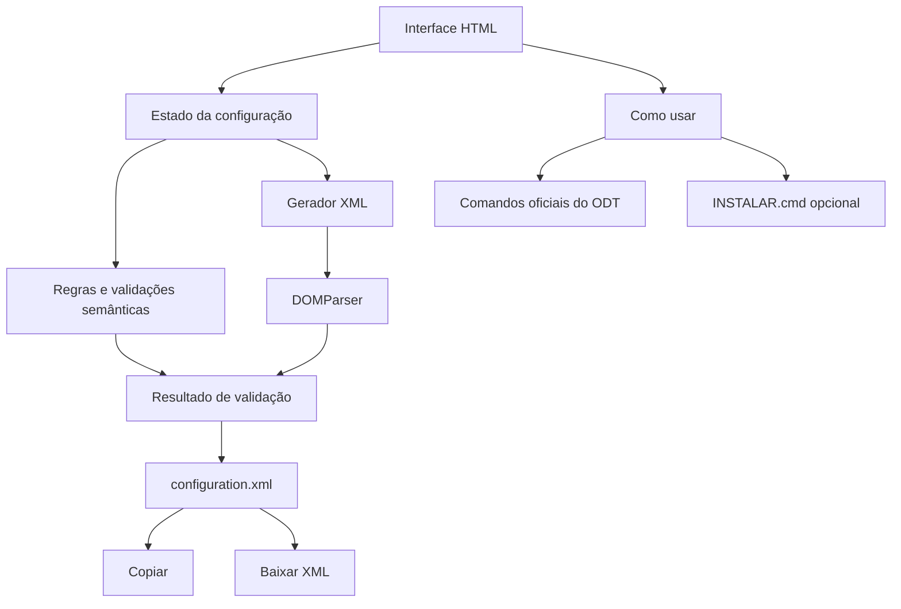
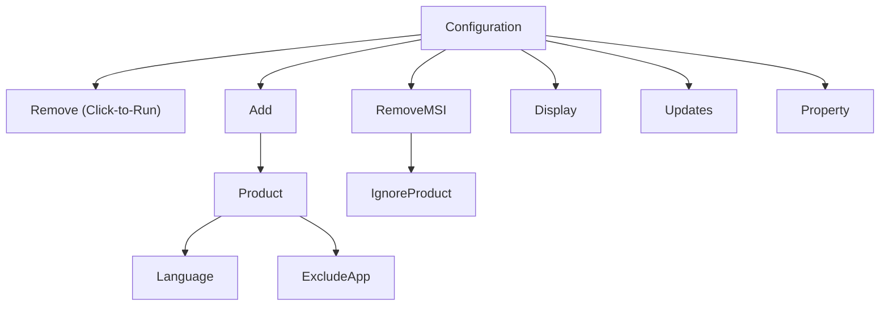
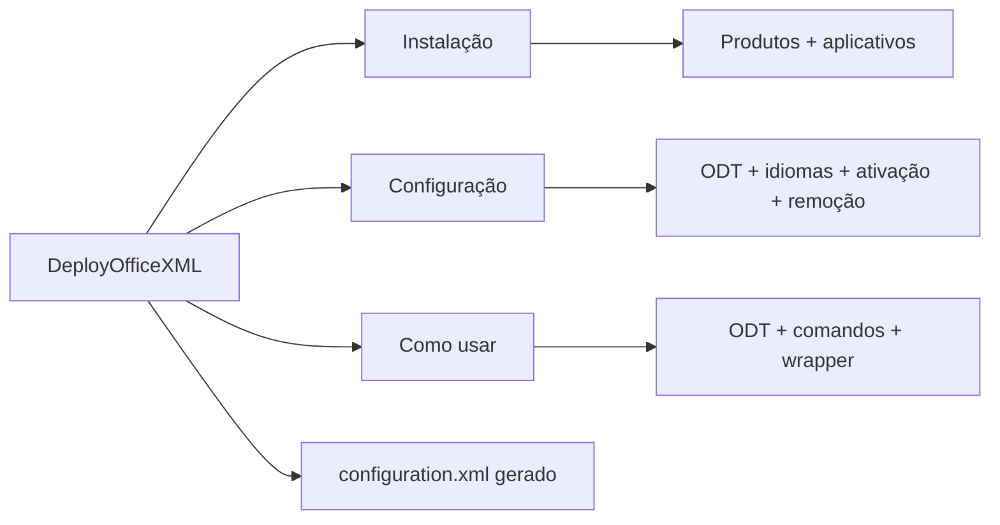
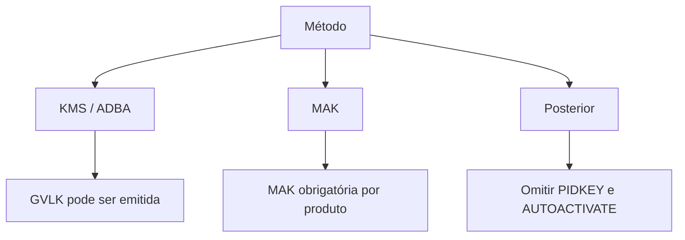
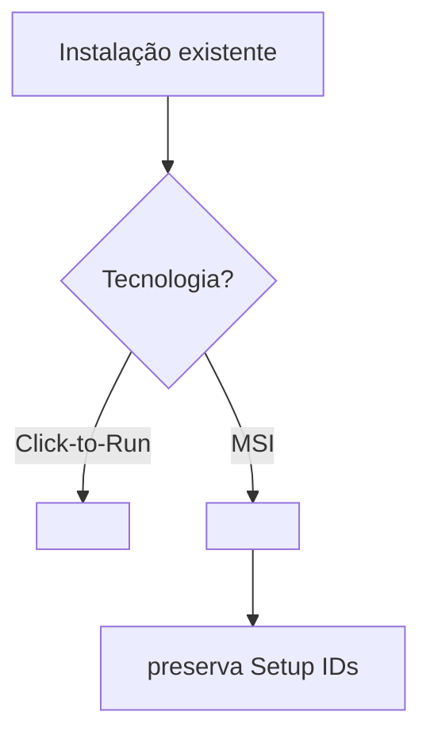
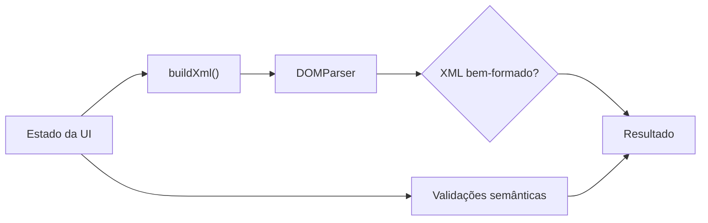
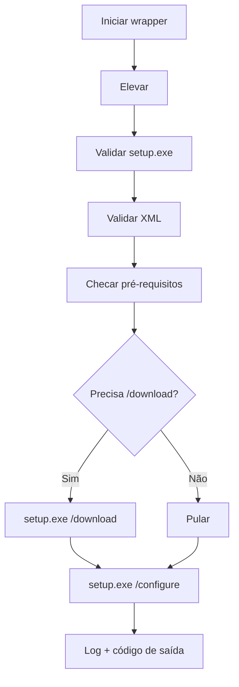

# DeployOfficeXML

> **Gerador técnico, local e auditável de `configuration.xml` para Office LTSC 2024, Project LTSC 2024 e Visio LTSC 2024 com o Office Deployment Tool (ODT).**

[](#idioma-e-convencoes)
[](#historico-desta-edicao)
[](#snapshot-e-politica-de-validacao)
[](#status-editorial)
[](#produtos-e-edicoes)
[](#privacidade-e-dependencias)

**Atalhos:** [🌐 Abrir a aplicação](./index.html) · [🚀 Fluxo de implantação](#fluxo-operacional-recomendado) · [🧩 Mapa completo da interface](#mapa-completo-da-interface) · [🗑️ IDs de remoção](#ids-para-remocao-click-to-run) · [🧹 IgnoreProduct](#preservar-no-removemsi-ignoreproduct) · [📖 Glossário](#glossario) · [📚 Referências](#referencias-primarias)

> [!IMPORTANT]
> **Projeto independente e não oficial.** Não possui afiliação, patrocínio ou endosso da Microsoft Corporation. Os nomes Microsoft, Office, Word, Excel, PowerPoint, Outlook, Visio, Project, Teams, OneDrive e demais marcas citadas são usados somente para identificar produtos, elementos do ODT, compatibilidade e comportamento técnico.

---

<a id="indice"></a>

## Índice

- [Resumo executivo](#resumo-executivo)
- [Principais recursos](#principais-recursos)
- [Como funciona internamente](#como-funciona-internamente)
- [Status editorial](#status-editorial)
  - [Escopo](#escopo)
  - [Fora de escopo](#fora-de-escopo)
  - [Snapshot e política de validação](#snapshot-e-politica-de-validacao)
- [Como usar este projeto](#como-usar-este-projeto)
  - [Trilhas de leitura](#trilhas-de-leitura)
  - [Fluxo operacional recomendado](#fluxo-operacional-recomendado)
- [00. Conceitos fundamentais](#conceitos-fundamentais)
  - [ODT, Click-to-Run e configuration.xml](#odt-click-to-run-e-configurationxml)
  - [Hierarquia mental do XML](#hierarquia-mental-do-xml)
  - [Remove e RemoveMSI não são a mesma coisa](#remove-e-removemsi-nao-sao-a-mesma-coisa)
- [01. Estado inicial da aplicação](#estado-inicial-da-aplicacao)
- [02. Mapa completo da interface](#mapa-completo-da-interface)
  - [Aba Instalação](#aba-instalacao)
  - [Aba Configuração](#aba-configuracao)
  - [Aba Como usar](#aba-como-usar)
  - [Saída configuration.xml](#saida-configurationxml)
- [03. Produtos e edições](#produtos-e-edicoes)
  - [Product IDs principais do LTSC 2024](#product-ids-principais-do-ltsc-2024)
  - [GVLKs de referência](#gvlks-de-referencia)
  - [PIDKEY: KMS/ADBA, MAK e posterior](#pidkey-kms-adba-mak-e-posterior)
- [04. Aplicativos e ExcludeApp](#aplicativos-e-excludeapp)
- [05. Instalação e origem](#instalacao-e-origem)
- [06. Atualizações](#atualizacoes)
- [07. Idiomas e Proofing Tools](#idiomas-e-proofing-tools)
- [08. Ativação](#ativacao)
- [09. Remoção de instalações existentes](#remocao-de-instalacoes-existentes)
  - [Click-to-Run: Remove](#click-to-run-remove)
  - [IDs para remoção Click-to-Run](#ids-para-remocao-click-to-run)
  - [MSI: RemoveMSI](#msi-removemsi)
  - [Preservar no RemoveMSI: IgnoreProduct](#preservar-no-removemsi-ignoreproduct)
  - [Como descobrir um Setup ID não listado](#como-descobrir-um-setup-id-nao-listado)
- [10. Configurações globais](#configuracoes-globais)
- [11. Mapeamento interface → XML](#mapeamento-interface-xml)
- [12. Validações do gerador](#validacoes-do-gerador)
- [13. Wrapper INSTALAR.cmd](#wrapper-instalarcmd)
- [14. Exemplos de configuração](#exemplos-de-configuracao)
- [15. Privacidade e dependências](#privacidade-e-dependencias)
- [16. Acessibilidade e responsividade](#acessibilidade-e-responsividade)
  - [Tema claro/escuro](#tema-claroescuro)
- [17. Estrutura do repositório e GitHub Pages](#estrutura-do-repositorio-e-github-pages)
- [18. Escopo técnico e limitações](#escopo-tecnico-e-limitacoes)
- [19. Tabelas-mestre de IDs](#tabelas-mestre-de-ids)
- [20. Glossário](#glossario)
- [21. Referências primárias](#referencias-primarias)
- [22. Identidade, marcas e publicação](#identidade-marcas-e-publicacao)
- [23. Histórico desta edição](#historico-desta-edicao)

---

<a id="resumo-executivo"></a>

## Resumo executivo

O **DeployOfficeXML** é uma aplicação HTML/CSS/JavaScript executada inteiramente no navegador que transforma opções relevantes do **Office Deployment Tool (ODT)** em um arquivo `configuration.xml` legível, validável e reutilizável.

O projeto é deliberadamente focado em implantações de **Office LTSC 2024 Volume**, **Project 2024 Volume** e **Visio LTSC 2024 Volume**. Ele não substitui o licenciamento da Microsoft, não ativa software sem infraestrutura ou chave válida, não consulta servidores para validar MAK e não pretende reproduzir integralmente o **Office Customization Tool (OCT)**. O OCT é o configurador oficial da Microsoft para criação e gerenciamento de arquivos de configuração em cenários mais amplos; o DeployOfficeXML mantém um escopo especializado em LTSC 2024 Volume, com foco em transparência do XML, validação local e orientação de implantação com o ODT.

A aplicação cobre seleção de produtos, edições, arquitetura, origem, idiomas, aplicativos, atualização, ativação, remoção, validação, geração do XML e orientação de implantação.

> [!NOTE]
> O gerador reduz erros de sintaxe e várias inconsistências semânticas conhecidas, mas **não substitui um teste real do ODT em laboratório**.

[Voltar ao índice](#indice)

---


<a id="principais-recursos"></a>

## Principais recursos

- Office LTSC 2024 Professional Plus e Standard;
- Project LTSC 2024 Professional e Standard;
- Visio LTSC 2024 Professional e Standard;
- arquitetura 32 ou 64 bits;
- `MigrateArch`;
- instalação via Office CDN ou `SourcePath` local/UNC;
- `AllowCdnFallback`;
- versão específica ou `MatchInstalled`;
- seleção de aplicativos convertida em `ExcludeApp`;
- idiomas explícitos, múltiplos idiomas completos e Proofing Tools;
- `MatchOS` com fallback;
- `MatchInstalled` com `TargetProduct`;
- atualizações via CDN ou `UpdatePath`;
- remoção Click-to-Run completa ou seletiva;
- `RemoveMSI` e `IgnoreProduct`;
- `FORCEAPPSHUTDOWN` e `AUTOACTIVATE`;
- KMS/ADBA, MAK ou configuração posterior;
- GVLKs públicas das seis edições Volume principais;
- validação sintática via `DOMParser`;
- validações semânticas adicionais;
- copiar e baixar `configuration.xml`;
- guia operacional embutido;
- wrapper `INSTALAR.cmd` opcional e auditável;
- interface client-side, responsiva e navegável por teclado;
- tema claro/escuro com preferência persistida localmente e fallback para o tema do sistema.

[Voltar ao índice](#indice)

---

<a id="como-funciona-internamente"></a>

## Como funciona internamente



A aplicação não envia os valores preenchidos a um backend. A engine mantém o estado no navegador, monta o XML, faz parse local e só então libera as ações de saída quando não existem erros críticos.

[Voltar ao índice](#indice)

---

<a id="status-editorial"></a>

## Status editorial

Este README é a **referência técnica pública da aplicação v1.1.2**. Ele documenta o comportamento efetivamente implementado no `index.html` e separa comportamento da aplicação, regras oficiais do ODT e recomendações operacionais.

A estrutura documental segue o nível de referência técnica solicitado: badges no topo, atalhos, índice navegável, tópicos e subtópicos, tabelas, Mermaid, glossário, referências e histórico.

<a id="escopo"></a>

### Escopo

- cada controle da página;
- seu valor padrão;
- XML produzido;
- dependências entre controles;
- Product IDs de remoção;
- Setup IDs documentados para `IgnoreProduct`;
- catálogo de idiomas;
- ativação;
- wrapper;
- validações;
- publicação.

<a id="fora-de-escopo"></a>

### Fora de escopo

- burlar licenciamento;
- gerar MAK;
- administrar KMS/ADBA;
- inventariar automaticamente o Office instalado;
- reproduzir todas as propriedades do ODT;
- substituir homologação.

<a id="snapshot-e-politica-de-validacao"></a>

### Snapshot e política de validação

**Snapshot documental: 2026-09-27.**

IDs, canais e comportamento podem mudar. Antes de produção, valide novamente a documentação oficial e teste o XML no ambiente alvo.

[Voltar ao índice](#indice)

---

<a id="como-usar-este-projeto"></a>

## Como usar este projeto

| Se você precisa... | Comece por... |
|---|---|
| Gerar um XML | [Abrir a aplicação](./index.html) |
| Entender cada campo | [Mapa completo da interface](#mapa-completo-da-interface) |
| Saber Product IDs de remoção | [IDs para remoção Click-to-Run](#ids-para-remocao-click-to-run) |
| Saber o que usar em IgnoreProduct | [Preservar no RemoveMSI](#preservar-no-removemsi-ignoreproduct) |
| Entender ativação | [Ativação](#ativacao) |
| Auditar XML | [Mapeamento interface → XML](#mapeamento-interface-xml) |
| Consultar termos | [Glossário](#glossario) |

<a id="trilhas-de-leitura"></a>

### Trilhas de leitura

| Perfil | Ordem sugerida |
|---|---|
| Uso rápido | Resumo → Fluxo → Mapa da interface |
| Admin Office | Conceitos → Produtos → Instalação → Atualizações → Remoção |
| Auditoria | Mapeamento → IDs → Idiomas → Ativação → Remoção |
| Migração | Remove/RemoveMSI → IgnoreProduct → SourcePath → MigrateArch |

<a id="fluxo-operacional-recomendado"></a>

### Fluxo operacional recomendado


[Voltar ao índice](#indice)

---

<a id="conceitos-fundamentais"></a>

## 00. Conceitos fundamentais

<a id="odt-click-to-run-e-configurationxml"></a>

### ODT, Click-to-Run e `configuration.xml`

| Conceito | Definição objetiva |
|---|---|
| ODT | *Office Deployment Tool*: `setup.exe` usado para baixar e configurar Office Click-to-Run. |
| Click-to-Run / C2R | tecnologia de instalação usada pelo LTSC 2024. |
| MSI | Windows Installer de versões antigas. |
| `configuration.xml` | arquivo declarativo consumido pelo ODT. |
| CDN | origem online da Microsoft para arquivos/updates. |
| Product ID | identificador Click-to-Run, como `ProPlus2024Volume`. |
| Setup ID | identificador MSI encontrado em `Setup.xml`, usado por `IgnoreProduct`. |

<a id="hierarquia-mental-do-xml"></a>

### Hierarquia mental do XML



- `<Product ID>` usa Product ID Click-to-Run;
- `<IgnoreProduct ID>` usa Setup ID MSI;
- `<ExcludeApp ID>` usa ID de aplicativo.

<a id="remove-e-removemsi-nao-sao-a-mesma-coisa"></a>

### `Remove` e `RemoveMSI` não são a mesma coisa

| Elemento | Alvo | Uso |
|---|---|---|
| `<Remove>` | Click-to-Run | remover produtos C2R |
| `<RemoveMSI>` | MSI | remover Office/Visio/Project antigos |
| `<IgnoreProduct>` | MSI | preservar produto MSI por Setup ID |

> [!WARNING]
> Não use `ProPlus2024Volume` como `IgnoreProduct`: esse é Product ID C2R, não Setup ID MSI.

[Voltar ao índice](#indice)

---

<a id="estado-inicial-da-aplicacao"></a>

## 01. Estado inicial da aplicação

| Área | Padrão | Resultado | Observação |
|---|---|---|---|
| Office | Ativo | `ProPlus2024Volume` / Professional Plus | `pt-br` |
| Project | Ativo | `ProjectPro2024Volume` / Professional | `pt-br` |
| Visio | Ativo | `VisioPro2024Volume` / Professional | `pt-br` |
| Arquitetura | 64 bits | `OfficeClientEdition="64"` | — |
| Canal | `PerpetualVL2024` | fixo/read-only | — |
| Origem | CDN/pasta do setup.exe | sem `SourcePath` | — |
| Proofing Tools | `en-us` | 1 idioma de revisão | — |
| Modo de idioma | Idiomas explícitos | `explicit` | — |
| Exclusões iniciais | Teams, Lync, OneDrive, Groove | `ExcludeApp` | — |
| Remove C2R | Remover todas | `<Remove All="TRUE" />` | — |
| RemoveMSI | On | `<RemoveMSI />` | — |
| Display | Full | `Level="Full"` | — |
| AcceptEULA | On | `TRUE` | — |
| Updates | On | Microsoft CDN | — |
| FORCEAPPSHUTDOWN | On | `TRUE` | — |
| AUTOACTIVATE | On | `1` | — |
| Ativação | KMS/ADBA | PIDKEYs incluídas | — |

O estado inicial é conveniência da ferramenta, não recomendação universal. Revise principalmente `Remove All`, `FORCEAPPSHUTDOWN`, PIDKEY e idiomas.

[Voltar ao índice](#indice)

---

<a id="mapa-completo-da-interface"></a>

## 02. Mapa completo da interface



<a id="aba-instalacao"></a>

### Aba Instalação

#### Office ProPlus 2024

**Checkbox**: inclui/remove o produto Office no `<Add>`. Se desmarcado, a grade de aplicativos é bloqueada.

**Edição**

| UI | Product ID |
|---|---|
| Professional Plus | `ProPlus2024Volume` |
| Standard | `Standard2024Volume` |

**PIDKEY**: em KMS/ADBA mostra GVLK; em MAK deve receber a chave da organização; em configuração posterior não é emitida.

**Idioma**: no modo explícito é o primeiro `<Language>` do produto.

#### Quais aplicativos deseja instalar?

A interface usa exclusão, porque o ODT trabalha com `ExcludeApp`: incluído = não gera `ExcludeApp`; excluído = gera `ExcludeApp`.

No Standard, Access fica indisponível.

#### Visio

- checkbox habilita produto;
- Professional → `VisioPro2024Volume`;
- Standard → `VisioStd2024Volume`;
- PIDKEY e idioma seguem as mesmas regras.

#### Project

- checkbox habilita produto;
- Professional → `ProjectPro2024Volume`;
- Standard → `ProjectStd2024Volume`;
- PIDKEY e idioma seguem as mesmas regras.

<a id="aba-configuracao"></a>

### Aba Configuração

#### Configurações globais

- **Remover instalações MSI antigas** → `<RemoveMSI>`;
- **Migrar arquitetura** → `MigrateArch="TRUE"`;
- **Forçar encerramento** → `FORCEAPPSHUTDOWN=TRUE`;
- **Ativação automática** → `AUTOACTIVATE=1` quando aplicável.

#### Instalação e origem

- Arquitetura;
- Origem da instalação;
- `SourcePath`;
- `AllowCdnFallback`;
- versão;
- display;
- canal;
- EULA.

#### Atualizações

- habilitar/desabilitar;
- Microsoft CDN ou `UpdatePath`.

#### Idiomas e ferramentas

- explícito;
- `MatchOS`;
- `MatchInstalled`;
- idiomas adicionais;
- `TargetProduct`;
- Proofing Tools.

#### Ativação

- KMS/ADBA;
- MAK;
- posterior;
- inclusão de PIDKEY.

#### Remoção

- `Remove` all/none/selective;
- `RemoveMSI`;
- `IgnoreProduct`.

#### Aplicativos a excluir

Sincronizado com a grade da aba Instalação.

<a id="aba-como-usar"></a>

### Aba Como usar

Não altera XML. Documenta ODT, organização de arquivos, comandos contextuais e wrapper opcional.

<a id="saida-configurationxml"></a>

### Saída `configuration.xml`

| Controle | Função |
|---|---|
| Restaurar original | volta ao estado inicial |
| Copiar | copia XML |
| Baixar XML | salva `configuration.xml` |
| Exibir/Ocultar código | recolhe/expande o XML |

[Voltar ao índice](#indice)

---

<a id="produtos-e-edicoes"></a>

## 03. Produtos e edições

### Produtos contemplados

| Família | Edições disponíveis |
|---|---|
| Office LTSC 2024 | Professional Plus / Standard |
| Project 2024 | Professional / Standard |
| Visio LTSC 2024 | Professional / Standard |

O configurador é deliberadamente focado em produtos **Volume 2024** e no canal `PerpetualVL2024`. A tabela-mestre posterior contém outros Product IDs apenas para referência técnica, auditoria e remoção seletiva.

<a id="product-ids-principais-do-ltsc-2024"></a>

### Product IDs principais do LTSC 2024

| Produto | Product ID | GVLK pública |
|---|---|---|
| Office LTSC Professional Plus 2024 | `ProPlus2024Volume` | `XJ2XN-FW8RK-P4HMP-DKDBV-GCVGB` |
| Office LTSC Standard 2024 | `Standard2024Volume` | `V28N4-JG22K-W66P8-VTMGK-H6HGR` |
| Project Professional 2024 | `ProjectPro2024Volume` | `FQQ23-N4YCY-73HQ3-FM9WC-76HF4` |
| Project Standard 2024 | `ProjectStd2024Volume` | `PD3TT-NTHQQ-VC7CY-MFXK3-G87F8` |
| Visio LTSC Professional 2024 | `VisioPro2024Volume` | `B7TN8-FJ8V3-7QYCP-HQPMV-YY89G` |
| Visio LTSC Standard 2024 | `VisioStd2024Volume` | `JMMVY-XFNQC-KK4HK-9H7R3-WQQTV` |

<a id="gvlks-de-referencia"></a>

### GVLKs de referência

A tabela anterior mostra as seis GVLKs públicas usadas pela aplicação.

> [!IMPORTANT]
> GVLK não é licença e não ativa Office sozinha. KMS/ADBA exige infraestrutura válida.

<a id="pidkey-kms-adba-mak-e-posterior"></a>

### PIDKEY: KMS/ADBA, MAK e posterior



[Voltar ao índice](#indice)

---

<a id="aplicativos-e-excludeapp"></a>

## 04. Aplicativos e `ExcludeApp`

### IDs aceitos pelo ODT

| ID | Componente | UI | Observação |
|---|---|---|---|
| `Access` | Access | Sim | Disponível no seletor principal; ignorado para Office Standard 2024. |
| `Excel` | Excel | Sim | Disponível no seletor principal. |
| `Groove` | Cliente legado de sincronização OneDrive for Business | Sim | Exclusão avançada/compatibilidade. |
| `Lync` | Skype for Business | Sim | Exclusão avançada/compatibilidade. |
| `OneDrive` | OneDrive | Sim | Disponível no seletor principal e sincronizado com exclusões. |
| `OneNote` | OneNote | Sim | Disponível no seletor principal. |
| `Outlook` | Outlook clássico | Sim | Disponível no seletor principal. |
| `OutlookForWindows` | Novo Outlook para Windows | Não | ID aceito pelo ODT, deliberadamente não exposto. |
| `PowerPoint` | PowerPoint | Sim | Disponível no seletor principal. |
| `Publisher` | Publisher | Não | ID aceito pelo ODT em cenários compatíveis; não exposto neste projeto. |
| `Teams` | Microsoft Teams | Sim | Exclusão avançada/compatibilidade. |
| `Word` | Word | Sim | Disponível no seletor principal. |

A grade principal expõe Word, Excel, PowerPoint, OneNote, Outlook, Access e OneDrive. A área avançada também oferece Teams, Lync, OneDrive e Groove.

Exemplo:

```xml
<ExcludeApp ID="Teams" />
```

[Voltar ao índice](#indice)

---

<a id="instalacao-e-origem"></a>

## 05. Instalação e origem

### Arquitetura

- 64 bits → `OfficeClientEdition="64"`;
- 32 bits → `OfficeClientEdition="32"`.

### `SourcePath`

Em modo local/rede, a UI aceita caminho local absoluto ou UNC.

```xml
SourcePath="\\servidor\Office2024"
```

HTTP/HTTPS não é aceito por este projeto em `SourcePath`.

### `AllowCdnFallback`

```xml
AllowCdnFallback="TRUE"
```

Permite fallback para CDN quando conteúdo local estiver ausente.

### `MigrateArch`

```xml
MigrateArch="TRUE"
```

Usado em migração 32↔64 bits quando aplicável.

### `Version`

Aceita vazio, `16.0.xxxxx.xxxxx` ou `MatchInstalled`.

### `Display` e EULA

```xml
<Display Level="Full" AcceptEULA="TRUE" />
```

[Voltar ao índice](#indice)

---

<a id="atualizacoes"></a>

## 06. Atualizações

### `PerpetualVL2024`

É o canal fixo deste configurador. A aplicação usa o mesmo valor em `<Add>` e `<Updates>`.

### `UpdatePath`

- Microsoft CDN → sem atributo;
- caminho personalizado → `UpdatePath="..."`.

A validação aceita local, UNC ou HTTP/HTTPS.

[Voltar ao índice](#indice)

---

<a id="idiomas-e-proofing-tools"></a>

## 07. Idiomas e Proofing Tools

### Idiomas explícitos

Cada produto recebe seu idioma principal; idiomas completos adicionais são adicionados aos produtos habilitados.

### `MatchOS`

```xml
<Language ID="MatchOS" Fallback="en-us" />
```

### `MatchInstalled`

```xml
<Language ID="MatchInstalled" />
```

ou:

```xml
<Language ID="MatchInstalled" TargetProduct="All" />
```

> [!WARNING]
> `MatchInstalled` não deve ser usado com `setup.exe /download`.

### Catálogo de idiomas da interface

| ID | Idioma | Office | Project/Visio |
|---|---|---|---|
| `af-za` | Afrikaans | Sim | Não |
| `sq-al` | Albanian | Sim | Não |
| `ar-sa` | العربية | Sim | Sim |
| `hy-am` | Հայերեն | Sim | Não |
| `as-in` | অসমীয়া | Sim | Não |
| `az-latn-az` | Azərbaycan | Sim | Não |
| `bn-bd` | বাংলা (Bangladesh) | Sim | Não |
| `bn-in` | বাংলা (India) | Sim | Não |
| `eu-es` | Euskara | Sim | Não |
| `bs-latn-ba` | Bosanski | Sim | Não |
| `bg-bg` | Български | Sim | Não |
| `ca-es` | Català | Sim | Não |
| `zh-cn` | 中文（简体） | Sim | Sim |
| `zh-tw` | 中文（繁體） | Sim | Sim |
| `hr-hr` | Hrvatski | Sim | Não |
| `cs-cz` | Čeština | Sim | Sim |
| `da-dk` | Dansk | Sim | Sim |
| `nl-nl` | Nederlands | Sim | Sim |
| `en-us` | English (US) | Sim | Sim |
| `en-gb` | English (UK) | Sim | Não |
| `et-ee` | Eesti | Sim | Não |
| `fi-fi` | Suomi | Sim | Sim |
| `fr-fr` | Français (France) | Sim | Sim |
| `fr-ca` | Français (Canada) | Sim | Não |
| `gl-es` | Galego | Sim | Não |
| `ka-ge` | ქართული | Sim | Não |
| `de-de` | Deutsch | Sim | Sim |
| `el-gr` | Ελληνικά | Sim | Sim |
| `gu-in` | ગુજરાતી | Sim | Não |
| `he-il` | עברית | Sim | Sim |
| `hi-in` | हिन्दी | Sim | Não |
| `hu-hu` | Magyar | Sim | Sim |
| `is-is` | Íslenska | Sim | Não |
| `id-id` | Bahasa Indonesia | Sim | Não |
| `ga-ie` | Gaeilge | Sim | Não |
| `it-it` | Italiano | Sim | Sim |
| `ja-jp` | 日本語 | Sim | Sim |
| `kn-in` | ಕನ್ನಡ | Sim | Não |
| `kk-kz` | Қазақша | Sim | Não |
| `ko-kr` | 한국어 | Sim | Sim |
| `lv-lv` | Latviešu | Sim | Não |
| `lt-lt` | Lietuvių | Sim | Não |
| `ms-my` | Bahasa Melayu | Sim | Não |
| `ml-in` | മലയാളം | Sim | Não |
| `mr-in` | मराठी | Sim | Não |
| `nb-no` | Norsk bokmål | Sim | Sim |
| `nn-no` | Norsk nynorsk | Sim | Não |
| `fa-ir` | فارسی | Sim | Não |
| `pl-pl` | Polski | Sim | Sim |
| `pt-br` | Português (Brasil) | Sim | Sim |
| `pt-pt` | Português (Portugal) | Sim | Sim |
| `pa-in` | ਪੰਜਾਬੀ | Sim | Não |
| `ro-ro` | Română | Sim | Sim |
| `ru-ru` | Русский | Sim | Sim |
| `sr-latn-rs` | Srpski (latinica) | Sim | Não |
| `sr-cyrl-rs` | Српски (ћирилица) | Sim | Não |
| `sk-sk` | Slovenčina | Sim | Sim |
| `sl-si` | Slovenščina | Sim | Sim |
| `es-es` | Español (España) | Sim | Sim |
| `es-mx` | Español (México) | Sim | Não |
| `sv-se` | Svenska | Sim | Sim |
| `ta-in` | தமிழ் | Sim | Não |
| `te-in` | తెలుగు | Sim | Não |
| `th-th` | ไทย | Sim | Não |
| `tr-tr` | Türkçe | Sim | Sim |
| `uk-ua` | Українська | Sim | Sim |
| `ur-pk` | اردو | Sim | Não |
| `vi-vn` | Tiếng Việt | Sim | Não |
| `cy-gb` | Cymraeg | Sim | Não |

### Proofing Tools

```xml
<Product ID="ProofingTools">
  <Language ID="en-us" />
</Product>
```

Proofing Tools são recursos de revisão, não o pacote completo de interface.

[Voltar ao índice](#indice)

---

<a id="ativacao"></a>

## 08. Ativação

### KMS

*Key Management Service*. Usa contexto Volume/GVLK e depende de host KMS legítimo.

### ADBA

*Active Directory-Based Activation*. Depende de infraestrutura de domínio; o gerador não configura o AD.

### MAK

*Multiple Activation Key*. Deve ser fornecida pela organização para cada produto habilitado.

### `AUTOACTIVATE`

Quando ativo e método não é posterior:

```xml
<Property Name="AUTOACTIVATE" Value="1" />
```

[Voltar ao índice](#indice)

---

<a id="remocao-de-instalacoes-existentes"></a>

## 09. Remoção de instalações existentes



<a id="click-to-run-remove"></a>

### Click-to-Run: `Remove`

- **Não remover** → omite `<Remove>`;
- **Remover todas** → `<Remove All="TRUE" />`;
- **Remoção seletiva** → lista `<Product ID="..."/>`.

<a id="ids-para-remocao-click-to-run"></a>

### IDs para remoção Click-to-Run

Use o **Product ID da instalação Click-to-Run que realmente deseja remover**.

Exemplo:

```xml
<Remove All="FALSE">
  <Product ID="ProPlus2021Volume" />
  <Product ID="VisioPro2021Volume" />
</Remove>
```

A tabela-mestre da seção 19 contém os Product IDs atualmente documentados pelo ODT.

<a id="msi-removemsi"></a>

### MSI: `RemoveMSI`

```xml
<RemoveMSI />
```

É voltado a versões Office/Visio/Project antigas instaladas via MSI. Para Office 2019+ Click-to-Run, use `<Remove>`.

<a id="preservar-no-removemsi-ignoreproduct"></a>

### Preservar no `RemoveMSI` (`IgnoreProduct`)

O campo usa **Setup IDs MSI**, não Product IDs Click-to-Run.

Exemplo:

```text
VisPro, PrjPro
```

gera:

```xml
<RemoveMSI>
  <IgnoreProduct ID="VisPro" />
  <IgnoreProduct ID="PrjPro" />
</RemoveMSI>
```

#### IDs explicitamente documentados pela Microsoft

| Setup ID | Produto/uso |
|---|---|
| `PrjStd` | Project Standard, Volume/MSI |
| `PrjPro` | Project Professional, Volume/MSI |
| `VisStd` | Visio Standard, Volume/MSI |
| `VisPro` | Visio Professional, Volume/MSI |
| `PrjStdR` | Project Standard, Retail/MSI |
| `PrjProR` | Project Professional, Retail/MSI |
| `VisStdR` | Visio Standard, Retail/MSI |
| `VisProR` | Visio Professional, Retail/MSI |
| `SharePointDesigner` | SharePoint Designer |
| `InfoPath` | InfoPath Volume |
| `InfoPathR` | InfoPath Retail |
| `AccessRT` | Access Runtime 2010 ou posterior |
| `AceRedist` | Access Database Engine Redistributable 2010 ou posterior |

#### Importante: não existe uma lista pública fechada de todos os Setup IDs

A Microsoft documenta que o valor correto é o **Setup ID encontrado em `Setup.xml`** na pasta `{product}.WW` da mídia MSI antiga. A documentação também informa que Lync 2013+ e produtos standalone podem ser removidos, mas não publica uma enumeração universal fechada para todos eles.

Por isso, afirmar uma lista “100% completa” por dedução seria tecnicamente incorreto.

<a id="como-descobrir-um-setup-id-nao-listado"></a>

### Como descobrir um Setup ID não listado

1. localize a mídia MSI antiga;
2. abra a pasta `{product}.WW`;
3. abra `Setup.xml`;
4. identifique o Setup ID;
5. use exatamente o valor em `<IgnoreProduct ID="..."/>`.

`IgnoreProduct` preserva produto inteiro. Não preserva um aplicativo interno de uma suíte MSI.

[Voltar ao índice](#indice)

---

<a id="configuracoes-globais"></a>

## 10. Configurações globais

### Remover instalações MSI antigas

Controla `<RemoveMSI>`.

### Migrar arquitetura

Controla `MigrateArch`.

### `FORCEAPPSHUTDOWN`

```xml
<Property Name="FORCEAPPSHUTDOWN" Value="TRUE" />
```

Pode fechar aplicativos com dados não salvos.

### Ativação automática

Controla `AUTOACTIVATE`.

### Aceitar EULA

Controla `AcceptEULA`.

[Voltar ao índice](#indice)

---

<a id="mapeamento-interface-xml"></a>

## 11. Mapeamento interface → XML

| Controle | XML | Regra |
|---|---|---|
| Office habilitado | `<Product ID="...">` | Só dentro de `<Add>`. |
| Edição Office | `ProPlus2024Volume` / `Standard2024Volume` | Troca Product ID e GVLK. |
| PIDKEY Office | `PIDKEY="..."` | Conforme método de ativação. |
| Idioma Office | `<Language ID="..." />` | Ou MatchOS/MatchInstalled. |
| Aplicativos Office | `<ExcludeApp ID="..." />` | Só excluídos são emitidos. |
| Project habilitado | `<Product ID="Project...">` | Professional/Standard. |
| Visio habilitado | `<Product ID="Visio...">` | Professional/Standard. |
| Arquitetura | `OfficeClientEdition="32|64"` | Atributo de `<Add>`. |
| Origem local/rede | `SourcePath="..."` | Somente modo path. |
| Fallback CDN | `AllowCdnFallback="TRUE"` | Somente origem local/rede. |
| Migrar arquitetura | `MigrateArch="TRUE"` | Opcional. |
| Versão | `Version="16.0..."` / `MatchInstalled` | Opcional. |
| Canal | `Channel="PerpetualVL2024"` | Usado em Add e Updates. |
| Display | `<Display Level="Full|None">` | Sempre emitido. |
| EULA | `AcceptEULA="TRUE|FALSE"` | Sempre emitido. |
| Updates | `<Updates Enabled="TRUE|FALSE">` | Sempre emitido. |
| UpdatePath | `UpdatePath="..."` | Só origem personalizada. |
| Idioma adicional | `<Language ID="..." />` | Aplicado a produtos habilitados. |
| MatchOS | `<Language ID="MatchOS" Fallback="..." />` | Substitui idiomas explícitos. |
| MatchInstalled | `<Language ID="MatchInstalled" ... />` | Segunda instalação. |
| TargetProduct | `TargetProduct="All"` | Omitido em Mesmo Product ID. |
| Proofing Tools | `<Product ID="ProofingTools">` | Produto separado no Add. |
| KMS/ADBA | GVLK em `PIDKEY` | Conforme checkbox. |
| MAK | MAK em `PIDKEY` | Obrigatória por produto. |
| Ativação posterior | omite PIDKEY/AUTOACTIVATE | Método posterior. |
| Remove all | `<Remove All="TRUE" />` | C2R. |
| Remove seletivo | `<Remove All="FALSE"><Product.../>` | Product IDs C2R. |
| RemoveMSI | `<RemoveMSI />` | MSI legado. |
| IgnoreProduct | `<IgnoreProduct ID="..." />` | Setup IDs MSI. |
| FORCEAPPSHUTDOWN | `<Property ... Value="TRUE" />` | Omitido em Off. |
| AUTOACTIVATE | `<Property ... Value="1" />` | Omitido em Off/posterior. |

[Voltar ao índice](#indice)

---

<a id="validacoes-do-gerador"></a>

## 12. Validações do gerador



### Erros críticos

- SourcePath ausente/inválido;
- UpdatePath ausente/inválido;
- remoção seletiva sem ID;
- Version inválida;
- MAK sem PIDKEY;
- PIDKEY incompleta;
- KMS com inclusão de PIDKEY ativa e chave ausente;
- idioma incompatível com Project/Visio;
- fallback MatchOS incompatível;
- XML malformado.

### Avisos

- nenhum produto/ProofingTools;
- MatchInstalled com `/download`;
- Access excluído em Standard;
- Remove All pode remover produto não reinstalado.

[Voltar ao índice](#indice)

---

<a id="wrapper-instalarcmd"></a>

## 13. Wrapper `INSTALAR.cmd`

O wrapper opcional implementa:

- elevação;
- XML;
- Authenticode;
- certificado Microsoft;
- SHA-256;
- mutex;
- espaço livre;
- reboot pendente;
- processos Office;
- logs;
- códigos de retorno;
- `3010`;
- decisão contextual sobre `/download`.



> [!WARNING]
> Audite o `.cmd` antes de executar. Alertas de segurança podem ocorrer devido a elevação e PowerShell.

[Voltar ao índice](#indice)

---

<a id="exemplos-de-configuracao"></a>

## 14. Exemplos de configuração

### Office ProPlus 2024 + KMS/ADBA

```xml
<Configuration>
  <Add OfficeClientEdition="64" Channel="PerpetualVL2024">
    <Product ID="ProPlus2024Volume"
             PIDKEY="XJ2XN-FW8RK-P4HMP-DKDBV-GCVGB">
      <Language ID="pt-br" />
      <ExcludeApp ID="Teams" />
      <ExcludeApp ID="Lync" />
      <ExcludeApp ID="OneDrive" />
      <ExcludeApp ID="Groove" />
    </Product>
  </Add>
  <RemoveMSI />
  <Display Level="Full" AcceptEULA="TRUE" />
  <Updates Enabled="TRUE" Channel="PerpetualVL2024" />
</Configuration>
```

### Preservar Visio MSI

```xml
<RemoveMSI>
  <IgnoreProduct ID="VisPro" />
</RemoveMSI>
```

### Remoção C2R seletiva

```xml
<Remove All="FALSE">
  <Product ID="ProPlus2021Volume" />
</Remove>
```

[Voltar ao índice](#indice)

---

<a id="privacidade-e-dependencias"></a>

## 15. Privacidade e dependências

- sem backend;
- sem analytics;
- sem telemetria;
- sem envio do XML;
- sem frameworks;
- sem fontes externas;
- sem logos oficiais incorporados;
- favicon próprio;
- `localStorage` usado somente para persistir a preferência Light/Dark (`deployofficexml-theme`).

A configuração ODT, PIDKEYs, caminhos, XML e demais campos **não são persistidos nem enviados pelo mecanismo de tema**.

[Voltar ao índice](#indice)

---

<a id="acessibilidade-e-responsividade"></a>

## 16. Acessibilidade e responsividade

- layout fluido;
- desktop/tablet/mobile;
- tabs centralizadas;
- foco visível;
- ARIA em tabs;
- navegação por setas/Home/End;
- estados não dependem só de cor;
- `prefers-reduced-motion`;
- proteção contra overflow horizontal.

<a id="tema-claroescuro"></a>

### Tema claro/escuro

A v1.1.0 acrescenta uma camada de tema sem alterar a engine de geração do XML. O botão no header alterna entre **Light** e **Dark** com um clique.

**Política de preferência:**

1. se existir uma preferência previamente salva em `localStorage`, ela prevalece;
2. na primeira visita, a aplicação usa `prefers-color-scheme`;
3. ao clicar no botão de tema, a escolha passa a ser persistida em `localStorage` sob a chave `deployofficexml-theme`;
4. nenhum dado do formulário, PIDKEY, caminho, idioma ou XML é armazenado pelo mecanismo de tema.

| Papel | Light | Dark |
|---|---|---|
| Fundo principal | `#F7F3EC` | `#1B1814` |
| Superfície | `#FFFCF7` | `#211E1A` |
| Superfície secundária | `#F1EBE1` | `#29241E` |
| Texto principal | `#171717` | `#EDE6DA` |
| Texto atenuado | `#625C54` | `#A99E90` |
| Bronze de ação | `#8A5A2B` | `#C58A4A` |
| Hover/foco | `#74491F` | `#D8A15E` |
| Borda funcional | `#908170` | `#7A6A58` |
| CodeBlock | `#EDE3D2` | `#24211D` |

O Dark segue o contrato **carvão + marfim + bronze**, sem transformar a página em marrom/sépia. O plano geral usa carvão mais profundo (`#15130F`), enquanto bandas e cards permanecem progressivamente mais claros para que a hierarquia de superfícies seja perceptível sem depender apenas de bordas. A interface pública não utiliza azul como cor de UI: mensagens informativas usam bronze + superfície neutra, enquanto `success`, `warning` e `danger` preservam famílias semânticas próprias.

O botão de tema possui `aria-pressed`, nome acessível que descreve a ação seguinte e foco visível. `meta[name="theme-color"]` também é atualizado para acompanhar o tema ativo.

[Voltar ao índice](#indice)

---

<a id="estrutura-do-repositorio-e-github-pages"></a>

## 17. Estrutura do repositório e GitHub Pages

```text
.
├── index.html
└── README.md
```

Sem build.

### GitHub Pages

1. `index.html` na raiz;
2. Settings → Pages;
3. Deploy from a branch;
4. branch + `/ (root)`.

### Mermaid

O GitHub renderiza blocos Mermaid em arquivos Markdown.

[Voltar ao índice](#indice)

---

<a id="escopo-tecnico-e-limitacoes"></a>

## 18. Escopo técnico e limitações

O projeto não:

- ativa sem licença;
- gera/consulta MAK;
- configura KMS/ADBA;
- inventaria a máquina;
- suporta todos os canais M365;
- substitui Intune/Configuration Manager;
- implementa toda propriedade genérica do ODT;
- substitui laboratório.

[Voltar ao índice](#indice)

---

<a id="tabelas-mestre-de-ids"></a>

## 19. Tabelas-mestre de IDs

<a id="product-ids-odt-atualmente-documentados"></a>

### Product IDs ODT atualmente documentados

> [!IMPORTANT]
> Estar nesta lista não significa que a UI instale esse produto. A lista serve como referência, especialmente para remoção seletiva de instalações Click-to-Run existentes.

#### Microsoft 365 / componentes gerais

| Product ID | Descrição / contexto |
|---|---|
| `O365ProPlusRetail` | Microsoft 365 Apps for enterprise / planos compatíveis |
| `O365BusinessRetail` | Microsoft 365 Apps for business / planos compatíveis |
| `O365ProPlusEEANoTeamsRetail` | Planos enterprise sem Teams (EEA) |
| `O365BusinessEEANoTeamsRetail` | Planos business sem Teams (EEA) |
| `VisioProRetail` | Visio por assinatura / retail compatível com ODT |
| `ProjectProRetail` | Project por assinatura / retail compatível com ODT |
| `AccessRuntimeRetail` | Access Runtime |
| `LanguagePack` | Pacote de idiomas |

#### Office / aplicativos 2021 e 2024

| Product ID | Descrição / contexto |
|---|---|
| `Access2021Retail` | Access 2021 Retail |
| `Access2024Retail` | Access 2024 Retail |
| `Access2021Volume` | Access 2021 Volume |
| `Access2024Volume` | Access LTSC 2024 Volume |
| `Excel2021Retail` | Excel 2021 Retail |
| `Excel2024Retail` | Excel 2024 Retail |
| `Excel2021Volume` | Excel 2021 Volume |
| `Excel2024Volume` | Excel LTSC 2024 Volume |
| `HomeBusiness2021Retail` | Office Home & Business 2021 |
| `HomeBusiness2024Retail` | Office Home & Business 2024 |
| `HomeStudent2021Retail` | Office Home & Student 2021 |
| `Home2024Retail` | Office Home 2024 |
| `O365HomePremRetail` | Microsoft 365 Home/Personal legado no catálogo ODT |
| `OneNoteFreeRetail` | OneNote gratuito |
| `OneNote2021Volume` | OneNote 2021 Volume |
| `OneNote2024Volume` | OneNote 2024 Volume |
| `OutlookRetail` | Outlook Retail genérico |
| `Outlook2021Retail` | Outlook 2021 Retail |
| `Outlook2024Retail` | Outlook 2024 Retail |
| `Outlook2021Volume` | Outlook 2021 Volume |
| `Outlook2024Volume` | Outlook 2024 Volume |
| `Personal2021Retail` | Office Personal 2021 |
| `PowerPoint2021Retail` | PowerPoint 2021 Retail |
| `PowerPoint2024Retail` | PowerPoint 2024 Retail |
| `PowerPoint2021Volume` | PowerPoint 2021 Volume |
| `PowerPoint2024Volume` | PowerPoint LTSC 2024 Volume |
| `Professional2021Retail` | Office Professional 2021 Retail |
| `Professional2024Retail` | Office Professional 2024 Retail |
| `ProPlus2021Volume` | Office Professional Plus 2021 Volume |
| `ProPlus2024Volume` | Office LTSC Professional Plus 2024 Volume |
| `ProPlusSPLA2021Volume` | Office Professional Plus 2021 SPLA |
| `ProPlus2021Retail` | Office Professional Plus 2021 Retail |
| `ProPlus2024Retail` | Office Professional Plus 2024 Retail |
| `Publisher2021Retail` | Publisher 2021 Retail |
| `Publisher2021Volume` | Publisher 2021 Volume |
| `Standard2021Volume` | Office Standard 2021 Volume |
| `StandardSPLA2021Volume` | Office Standard 2021 SPLA |
| `Standard2024Volume` | Office LTSC Standard 2024 Volume |
| `Word2021Retail` | Word 2021 Retail |
| `Word2024Retail` | Word 2024 Retail |
| `Word2021Volume` | Word 2021 Volume |
| `Word2024Volume` | Word LTSC 2024 Volume |

#### Project

| Product ID | Descrição / contexto |
|---|---|
| `ProjectPro2021Retail` | Project Professional 2021 Retail |
| `ProjectPro2024Retail` | Project Professional 2024 Retail |
| `ProjectPro2021Volume` | Project Professional 2021 Volume |
| `ProjectPro2024Volume` | Project Professional 2024 Volume |
| `ProjectStdRetail` | Project Standard Retail genérico |
| `ProjectStd2021Retail` | Project Standard 2021 Retail |
| `ProjectStd2024Retail` | Project Standard 2024 Retail |
| `ProjectStd2021Volume` | Project Standard 2021 Volume |
| `ProjectStd2024Volume` | Project Standard 2024 Volume |

#### Visio

| Product ID | Descrição / contexto |
|---|---|
| `VisioPro2021Retail` | Visio Professional 2021 Retail |
| `VisioPro2024Retail` | Visio Professional 2024 Retail |
| `VisioPro2021Volume` | Visio Professional 2021 Volume |
| `VisioPro2024Volume` | Visio LTSC Professional 2024 Volume |
| `VisioStdRetail` | Visio Standard Retail genérico |
| `VisioStd2021Retail` | Visio Standard 2021 Retail |
| `VisioStd2024Retail` | Visio Standard 2024 Retail |
| `VisioStd2021Volume` | Visio Standard 2021 Volume |
| `VisioStd2024Volume` | Visio LTSC Standard 2024 Volume |

#### Skype for Business

| Product ID | Descrição / contexto |
|---|---|
| `SkypeforBusiness2021Volume` | Skype for Business LTSC 2021 |
| `SkypeforBusiness2024Volume` | Skype for Business LTSC 2024 |

<a id="excludeapp-ids"></a>

### `ExcludeApp` IDs

| ID | Significado |
|---|---|
| `Access` | Access |
| `Excel` | Excel |
| `Groove` | Cliente legado de sincronização OneDrive for Business |
| `Lync` | Skype for Business |
| `OneDrive` | OneDrive |
| `OneNote` | OneNote |
| `Outlook` | Outlook clássico |
| `OutlookForWindows` | Novo Outlook para Windows |
| `PowerPoint` | PowerPoint |
| `Publisher` | Publisher |
| `Teams` | Microsoft Teams |
| `Word` | Word |

<a id="ignoreproduct-setup-ids"></a>

### `IgnoreProduct` / Setup IDs

| Setup ID | Produto/uso |
|---|---|
| `PrjStd` | Project Standard, Volume/MSI |
| `PrjPro` | Project Professional, Volume/MSI |
| `VisStd` | Visio Standard, Volume/MSI |
| `VisPro` | Visio Professional, Volume/MSI |
| `PrjStdR` | Project Standard, Retail/MSI |
| `PrjProR` | Project Professional, Retail/MSI |
| `VisStdR` | Visio Standard, Retail/MSI |
| `VisProR` | Visio Professional, Retail/MSI |
| `SharePointDesigner` | SharePoint Designer |
| `InfoPath` | InfoPath Volume |
| `InfoPathR` | InfoPath Retail |
| `AccessRT` | Access Runtime 2010 ou posterior |
| `AceRedist` | Access Database Engine Redistributable 2010 ou posterior |

Para qualquer outro produto MSI, use o Setup ID de `Setup.xml`. Não adivinhe.

[Voltar ao índice](#indice)

---

<a id="glossario"></a>

## 20. Glossário

| Termo | Definição |
|---|---|
| ADBA | *Active Directory-Based Activation*. |
| AllowCdnFallback | fallback da origem local para CDN. |
| AUTOACTIVATE | solicita tentativa automática de ativação. |
| CDN | *Content Delivery Network*. |
| Click-to-Run / C2R | tecnologia de instalação do LTSC 2024. |
| ExcludeApp | exclusão de aplicativo dentro de uma suíte. |
| FORCEAPPSHUTDOWN | permite encerrar apps que bloqueiam instalação. |
| GVLK | *Generic Volume License Key*. Chave pública para contexto Volume/KMS. |
| IgnoreProduct | preserva produto MSI em `RemoveMSI`. |
| KMS | *Key Management Service*. |
| Language ID | código de idioma/cultura do ODT. |
| MAK | *Multiple Activation Key*. |
| MatchInstalled | acompanha idiomas de produto já instalado. |
| MatchOS | acompanha idioma(s) do SO. |
| MigrateArch | migração 32↔64 quando suportada. |
| MSI | Windows Installer. |
| ODT | Office Deployment Tool. |
| OfficeClientEdition | arquitetura 32/64 do `<Add>`. |
| PerpetualVL2024 | canal LTSC 2024 usado pelo projeto. |
| PIDKEY | chave informada no `<Product>`. |
| Product ID | ID Click-to-Run. |
| Proofing Tools | recursos de revisão de idioma. |
| Remove | remove produto Click-to-Run. |
| RemoveMSI | remove produtos MSI antigos. |
| Setup ID | ID MSI obtido de `Setup.xml`. |
| SourcePath | origem local/UNC do payload. |
| TargetProduct | fonte de idioma para MatchInstalled. |
| UpdatePath | origem personalizada de updates. |

[Voltar ao índice](#indice)

---

<a id="referencias-primarias"></a>

## 21. Referências primárias

### Office LTSC 2024

- Implantar Office LTSC 2024  
  https://learn.microsoft.com/pt-br/office/ltsc/2024/deploy
- Visão geral  
  https://learn.microsoft.com/pt-br/office/ltsc/2024/overview
- Atualizações / PerpetualVL2024  
  https://learn.microsoft.com/pt-br/office/ltsc/2024/update

### Office Customization Tool (OCT)

- Configurador oficial  
  https://config.office.com/deploymentsettings
- Visão geral do OCT  
  https://learn.microsoft.com/pt-br/microsoft-365-apps/admin-center/overview-office-customization-tool

### ODT

- Opções de configuração  
  https://learn.microsoft.com/pt-br/microsoft-365-apps/deploy/office-deployment-tool-configuration-options
- Product IDs suportados  
  https://learn.microsoft.com/en-us/microsoft-365/troubleshoot/installation/product-ids-supported-office-deployment-click-to-run
- Download oficial  
  https://www.microsoft.com/en-us/download/details.aspx?id=49117

### Remoção / migração

- RemoveMSI e IgnoreProduct  
  https://learn.microsoft.com/pt-br/microsoft-365-apps/deploy/upgrade-from-msi-version
- Coexistência Office/Project/Visio  
  https://learn.microsoft.com/pt-br/microsoft-365-apps/deploy/install-different-office-visio-and-project-versions-on-the-same-computer

### Ativação

- Ativação por volume  
  https://learn.microsoft.com/pt-br/office/volume-license-activation/plan-volume-activation-of-office
- KMS  
  https://learn.microsoft.com/pt-br/office/volume-license-activation/activate-office-by-using-kms

### Idiomas

- Implantação de idiomas  
  https://learn.microsoft.com/pt-br/microsoft-365-apps/deploy/overview-deploying-languages-microsoft-365-apps

### GitHub

- Mermaid no GitHub  
  https://docs.github.com/pt/get-started/writing-on-github/working-with-advanced-formatting/creating-diagrams

[Voltar ao índice](#indice)

---

<a id="identidade-marcas-e-publicacao"></a>

## 22. Identidade, marcas e publicação

DeployOfficeXML usa identidade própria e evita logos/ícones oficiais como elementos de marca. Os nomes de produtos são utilizados apenas para descrição técnica.

### Licença

Este README não inventa uma licença. Antes de publicar uma `LICENSE`, defina explicitamente a licença do código e da documentação.

<a id="idioma-e-convencoes"></a>

### Idioma e convenções

- pt-BR;
- elementos/atributos XML preservam nomes oficiais;
- IDs aparecem em `monospace`;
- “Remove” = C2R e “RemoveMSI” = MSI;
- siglas são expandidas no uso pedagógico e consolidadas no glossário.

[Voltar ao índice](#indice)

---

<a id="historico-desta-edicao"></a>

## 23. Histórico desta edição

### 1.1.2 — 2026-09-27

Patch corretivo de qualidade, acessibilidade, validação e consistência interna, **sem alterar o payload embutido do `INSTALAR.cmd` e preservando o XML ODT nos cenários não afetados**.

- corrigida a semântica HTML/ARIA de labels, toggle de tema, estados de botões e hierarquia de headings;
- removidos CSS morto/redundante e reprocessamentos JavaScript comprovadamente desnecessários;
- corrigida a validação de `UpdatePath` HTTP/HTTPS para rejeitar URLs sintaticamente inválidas;
- corrigido o syntax highlighting de atributos XML contendo entidades escapadas;
- `prefers-reduced-motion` agora também é respeitado pelo scroll acionado via JavaScript;
- o aviso de `Remove All` agora acompanha corretamente o modo de remoção selecionado;
- preservados os estados de `includePidKey` e `AUTOACTIVATE` durante a troca entre KMS/ADBA, MAK e configuração posterior;
- atualizado o download oficial do Office Deployment Tool para `https://www.microsoft.com/en-us/download/details.aspx?id=49117`, pois o endpoint localizado em `pt-br` deixou de estar disponível;
- snapshot documental revalidado em 2026-09-27 contra referências oficiais aplicáveis;
- Gate Final aprovado com regressão não detectada nos testes executados;
- payload `INSTALAR.cmd` preservado byte a byte, com SHA-256 `9ecc6196235752f33cacec3a0fdb6d87b1b4c7e1c08fda026cf71dcfef256c91`.

### 1.1.1 — 2026-09-27

Atualização editorial de posicionamento e referências, **sem alterar a engine ODT/XML**.

- adicionada referência explícita ao Office Customization Tool (OCT) oficial da Microsoft;
- esclarecida a diferença de escopo entre o OCT, voltado a cenários mais amplos, e o DeployOfficeXML, especializado em LTSC 2024 Volume;
- adicionados o configurador oficial e a documentação do OCT às referências primárias;
- nenhuma lógica de Product ID, PIDKEY, idioma, remoção, XML, validação, wrapper, CSS ou JavaScript foi alterada.

### 1.1.0 — 2026-08-30

Evolução visual e de acessibilidade sobre a baseline pública 1.0.3, **sem alterar a engine ODT/XML**.

- adicionado tema Light/Dark;
- primeira visita respeita `prefers-color-scheme`;
- seleção manual persiste somente a preferência de tema em `localStorage`;
- botão sol/lua acessível no header;
- `theme-color` acompanha o tema ativo;
- Dark usa carvão, marfim e bronze conforme matriz cromática acessível;
- removidos resíduos azuis do estado `info`; mensagens informativas usam bronze + superfície neutra, enquanto `success`, `warning` e `danger` permanecem semanticamente independentes;
- CodeBlock XML e blocos de comando recebem tratamento Dark próprio;
- responsividade e tabs preservadas;
- nenhuma lógica de Product ID, PIDKEY, idioma, remoção, XML, validação ou wrapper foi alterada.

### Baseline documental herdada da 1.0.3

Revisão documental ampla, sem alteração da engine:

- preservado o escopo do README anterior;
- adicionados badges, atalhos e índice hierárquico;
- adicionados diagramas Mermaid;
- documentado cada bloco da UI;
- adicionada matriz interface → XML;
- detalhados `Remove`, `RemoveMSI` e `IgnoreProduct`;
- documentados Product IDs de remoção seletiva;
- documentados Setup IDs oficialmente publicados;
- registrada a ausência de uma enumeração pública fechada de todos os Setup IDs;
- documentado o método correto via `Setup.xml`;
- listados todos os `ExcludeApp` aceitos pelo ODT;
- documentado o catálogo real de idiomas da v1.1.0;
- aprofundadas ativação e GVLK/MAK;
- documentadas validações e wrapper;
- consolidadas referências e glossário.

---

**DeployOfficeXML** — configuração visual, local e auditável de `configuration.xml` para Office LTSC 2024 com Office Deployment Tool.
